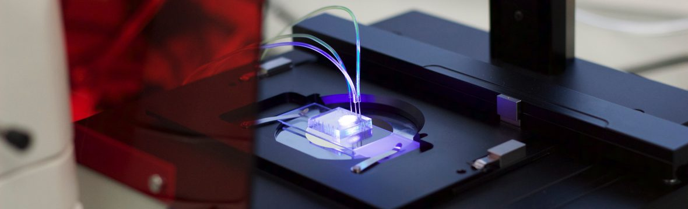

---
# Feel free to add content and custom Front Matter to this file.
# To modify the layout, see https://jekyllrb.com/docs/themes/#overriding-theme-defaults

layout: page #home
description: "Official website of Jacques Fattaccioli, Professor in Chemistry at Sorbonne Université. Research in microfluidics, soft matter, biophysics, and biotech innovation."
---

```markdown
# Welcome

I am Jacques Fattaccioli, Associate Professor in Chemistry at [École Normale Supérieure](https://www.ens.psl.eu/) (ENS-PSL), part of the MesoBioLab team within the CPCV Laboratory (Paris, France). 

My work sits at the interface of microfluidics, soft matter, biophysics, and immunology, with a strong emphasis on droplet-based microfluidic systems. We design microfluidic platforms and surface/interface strategies to generate and functionalize droplets, control microscale environments, and build quantitative experiments that connect physico-chemical principles to biologically relevant questions.




Our group develops **microfluidic platforms and engineered soft matter objects** to address quantitative questions in biology, at scales ranging from single molecules to whole organisms.

A central research direction is the design of **functional droplets and particles** — lipid droplets engineered as artificial antigen-presenting cells, degradable microcapsules, and surface-functionalized microparticles — used as versatile tools to probe immune cell mechanics, phagocytosis, and receptor-ligand interactions with controlled interface chemistry.

We also develop **microfluidic platforms for quantitative cell biology**, combining hydrodynamic trapping arrays, droplet-based compartmentalization, and fluorescence microscopy to study single-cell dynamics, immune cell polarization, and intracellular processes at high throughput.

A third axis extends microfluidic approaches to **plant and environmental biology**: from the spatio-temporal study of moss development and microalgae phenotyping, to the dynamics of hydrocarbon-degrading bacterial biofilms at oil-water interfaces.

Feel free to contact us for any questions about our [research](/research/), [open positions](/positions/), or potential collaborations.
```


